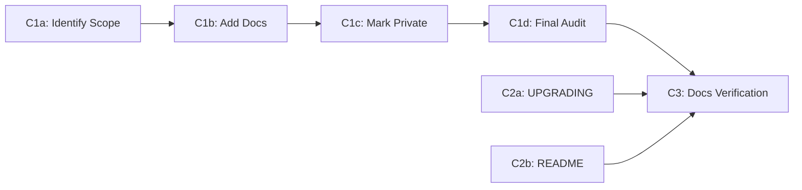

# Phase 4 / Step C — Update Documentation: Execution Plan

> **🚧 Status: Partial.**
>
> Core infrastructure complete (`UPGRADING.md` exists, `@api` markers applied to
> parts of the library).
>
> Remaining work:
>
> - bring `yardstick` coverage to 100% across all of `lib/` (see Done-When)
> - confirm `README.md` reflects the new entry points and links to migration guide
> - run full final documentation audit before v5.0.0 release.
>

- [Goal](#goal)
- [Done-When Criteria](#done-when-criteria)
- [Workstreams \& PR Granularity](#workstreams--pr-granularity)
- [PR Creation Protocol](#pr-creation-protocol)
- [C1a Results Storage](#c1a-results-storage)
- [C1 — Public API YARD Audit \& Coverage](#c1--public-api-yard-audit--coverage)
  - [C1a — Identify public API scope](#c1a--identify-public-api-scope)
    - [C1a Steps (executable)](#c1a-steps-executable)
    - [Classification heuristics](#classification-heuristics)
  - [C1b — Document all elements for yardstick](#c1b--document-all-elements-for-yardstick)
  - [C1c — Set correct `@api` tags](#c1c--set-correct-api-tags)
  - [C1d — Achieve 100%, set 98% floor, document policy](#c1d--achieve-100-set-98-floor-document-policy)
- [C2 — Guidance \& README Update](#c2--guidance--readme-update)
  - [C2a — Update `UPGRADING.md` (PR)](#c2a--update-upgradingmd-pr)
  - [C2b — Update `README.md` (PR)](#c2b--update-readmemd-pr)
- [C3 — Documentation Completeness Verification](#c3--documentation-completeness-verification)
  - [C3a — Run full CI pipeline](#c3a--run-full-ci-pipeline)
  - [C3b — Manual documentation spot-check](#c3b--manual-documentation-spot-check)
  - [C3c — Link validation](#c3c--link-validation)
  - [C3d — Step C sign-off](#c3d--step-c-sign-off)
- [Resolved Decisions](#resolved-decisions)
  - [YARD `@api private` scope](#yard-api-private-scope)
  - [Topic module documentation](#topic-module-documentation)
  - [README vs. UPGRADING split](#readme-vs-upgrading-split)
  - [Documentation coverage bar](#documentation-coverage-bar)
- [Execution Notes](#execution-notes)
  - [Sequencing \& Parallelization](#sequencing--parallelization)
  - [RSpec for documentation examples](#rspec-for-documentation-examples)
  - [Out of scope: gem release](#out-of-scope-gem-release)
- [File Checklist](#file-checklist)
- [Step C Completion Checklist (C3d)](#step-c-completion-checklist-c3d)

## Goal

Complete the documentation required for a stable v5.0.0 release:

1. Ensure all **public-API classes and methods** have complete YARD documentation
   with no gaps.
2. Mark all **internal classes** (`ExecutionContext`, `Commands::*`, `Path*`,
   `Parser*`) with `@api private` to signal they are not part of the stable
   public contract.
3. Provide **migration guidance** via `UPGRADING.md` explaining all v5.0.0
   breaking changes and how to migrate from v4.x.
4. Update **`README.md`** to reflect the new public entry points
   (`Git`, `Git::Repository`, etc.) and link to the migration guide.

Source of truth in the implementation tracker:
[`3_architecture_implementation.md`](3_architecture_implementation.md) →
"Phase 4 → Step C — Update documentation".

This is the final step of Phase 4, following [Step A](Phase%204%20-%20Step%20A.md)
(remove old code) and [Step B](Phase%204%20-%20Step%20B.md) (finalize test suite).
All breaking changes are complete; this step documents them for users.

---

## Done-When Criteria

- **Documentation is complete at 100%.** Every class, module, and method in
  `lib/` — **public and internal alike** — satisfies yardstick's rules: a
  summary, an `@api` tag (`public`, `semipublic`, or `private`), documented
  parameters and return values, and an `@example` for public/semipublic methods.
  `bundle exec yardstick 'lib/**/*.rb'` reports **100%** at the end of Step C.
  - `@api private` is a **stability/visibility signal** (it marks internal
    implementation detail that users must not depend on); it is **not** a
    documentation exemption. Internal classes still require complete docs.
- **CI enforces a 98% floor, not 100%.** `tasks/yard.rake` sets the `yardstick`
  `verify.threshold` to **98** (with `require_exact_threshold: false`, i.e.
  "≥98%"). The codebase ships at 100%, but the enforced gate sits below it so a
  later unrelated contribution with a small doc gap does not break CI. The goal
  remains 100%; maintainers close any residual gaps in follow-up PRs.
- `bundle exec rake yard:build` passes with no warnings. The `--fail-on-warning`
  flag lives in `.yardopts` (which `yard:build` reads), not in the rake task
  itself, so undocumented-object and other YARD warnings fail the build. Use
  `bundle exec yardstick 'lib/**/*.rb'` and `bundle exec yard stats --list-undoc`
  as diagnostics to locate remaining gaps.
- `UPGRADING.md` exists (already done) and comprehensively covers:
  - Breaking change overview (v4.x → v5.0.0).
  - Old entry points (`Git::Base`, `Git::Lib`) and their replacements
    (`Git::Repository` via `Git.open`, etc.).
  - Common migration patterns (command usage, return types, error handling).
  - Any deprecated methods still available for transitional use.
- `README.md` is updated to:
  - Prominently show the new public entry points (`Git`, `Git::Repository`).
  - Link to `UPGRADING.md` for migration guidance.
  - Include examples using the new `Git::Repository` facade layer.
  - Remove or contextualize any outdated references to `Git::Base` / `Git::Lib`.
- No **runtime or tooling references** to old code paths remain in the main
  library documentation — only CHANGELOG, historical design docs, and deprecated
  skill stubs (if any) may mention old classes contextually.
- Full CI pipeline (RSpec + YARD + linters) is green.
- **Out of scope:** the actual v5.0.0 gem release (CHANGELOG finalization, `v5.0.0`
  tag, `gem build`/`push`, GitHub release notes). Step C ends at docs-complete + CI
  green and hands off to the separate release process.

---

## Workstreams & PR Granularity

This step is organized into workstreams, each with **one PR per substep** for finer-grained reviews:

- **C1a: Identify Public API Scope** (1 PR)
- **C1b: Document All Elements for yardstick** (1 PR)
- **C1c: Set Correct @api Tags (incl. flip topic modules to private)** (1 PR)
- **C1d: Achieve 100% Coverage, Set 98% CI Floor & Final Audit** (1 PR)
- **C2a: Update UPGRADING.md** (1 PR)
- **C2b: Update README.md** (1 PR)
- **C3: Documentation Completeness Verification** (1 PR)

Dependencies: C1a → C1b → C1c → C1d → C3; C2a, C2b → C3

**Documentation skill requirements:** All C1b-C1d PRs must apply the
[yard-documentation](../.github/skills/yard-documentation/SKILL.md) skill to all
YARD comments changed or added. Additionally:

- For `Git::Commands::*` classes, also apply the
  [command-yard-documentation](../.github/skills/command-yard-documentation/SKILL.md) skill
- For `Git::Repository::*` facade methods, also apply the
  [facade-yard-documentation](../.github/skills/facade-yard-documentation/SKILL.md) skill



---

## PR Creation Protocol

All Step C PRs are created in **`ruby-git/ruby-git`** and target base branch
**`main`**. Use one PR per substep from the granularity list above.

- Create a dedicated topic branch per substep (for example:
  `docs/phase-4-step-c-c1a-scope`).
- Open each PR with `gh pr create` after pushing that topic branch.
- Keep each PR scoped to the substep's deliverables:
  - **C1a PR:** `redesign/c1a-public-api-scope.tsv` (and only minimal related plan/tracker
    adjustments if strictly required for accuracy).
  - **C1b PR:** YARD docs in `lib/**/*.rb` for every element (public and internal)
    that yardstick reports as incomplete.
  - **C1c PR:** correct `@api` tags in `lib/**/*.rb` for every element per the C1a
    TSV, including flipping the `Git::Repository::*` topic modules that are
    currently `@api public` to `@api private`.
  - **C1d PR:** drive `yardstick` coverage to 100%, set the enforced threshold to
    **98** in `tasks/yard.rake`, and add the YARD-coverage policy note to
    `CONTRIBUTING.md`; include no unrelated migration-guide or README edits.
  - **C2a PR:** `UPGRADING.md` updates only.
  - **C2b PR:** `README.md` updates only.
  - **C3 PR:** verification/sign-off updates only (for example Step C completion
    tracking in `redesign/3_architecture_implementation.md`).

If verification discovers additional documentation defects, fix them in the
appropriate workstream PR (C1* or C2*) rather than broadening C3 scope.

---

## C1a Results Storage

The results of C1a (public API scope identification) will be stored in:

```text
redesign/c1a-public-api-scope.tsv
```

This TSV file will contain columns:

- `constant_name` — fully qualified class/module/method name
- `type` — "class", "module", or "method"
- `scope` — "public" or "internal"
- `category` — e.g. "entry-point", "return-type", "value-object", "topic-module",
  "command-wrapper", "parser", "plumbing", "state-object", etc.
- `api_private_current` — "yes" or "no": whether `@api private` is already applied
  (drives the C1c gap-fill so it only touches what's still unmarked)
- `defining_file` — path to the file where the constant is defined (e.g.,
  `lib/git/object.rb` for `Git::Object::Blob`)
- `notes` — any relevant context or classification rationale

Subsequent PRs (C1b, C1c, C1d) will reference this file to understand the scope
decisions made in C1a. The file serves as the source of truth for public vs.
internal classification.

---

## C1 — Public API YARD Audit & Coverage

**Goal:** Verify all public-API classes and methods have complete documentation;
mark internal classes with `@api private`.

### C1a — Identify public API scope

**Goal:** Produce a complete, authoritative classification of every class/module
in `lib/` as either **public** (part of the stable v5.0.0 contract) or **internal**
(`@api private`). This classification is the source of truth consumed by C1b, C1c,
and C1d.

> **⚠️ The lists below are ILLUSTRATIVE, not exhaustive.** The C1a agent MUST
> enumerate the real set of classes/modules via tooling (`yard list`) and classify
> every entry — do not treat these lists as complete. Many public value objects are
> not named here (e.g., `Git::Author`, `Git::Branches`, `Git::Stash`,
> `Git::Worktree`, `Git::Url`, `Git::FileRef`, and numerous `*Info`/`*Result`
> objects), and the majority of internal classes are `Git::Commands::*` and parser
> classes.

#### C1a Steps (executable)

1. **Enumerate all top-level and nested constants.** Generate the full class/module
   inventory with YARD:

   ```bash
   bundle exec yard list --query 'object.type == :class || object.type == :module'
   ```

   (Or parse `bundle exec yard stats --list-undoc` output.) Cross-check
   against the file tree (Ruby is cross-platform; `find` is not available in a
   default Windows shell):

   ```bash
   ruby -e "puts Dir.glob('lib/**/*.rb').sort"
   ```

2. **Classify each constant** as `public` or `internal` using the heuristics below.
3. **Detect current `@api private` state** for each so C1c knows what still needs
   marking (`git grep` is cross-platform since Git is already a prerequisite):

   ```bash
   git grep -l '@api private' -- lib/
   ```

4. **Write the results** to `redesign/c1a-public-api-scope.tsv` (schema in the
   "C1a Results Storage" section above). Every enumerated constant gets one row.

#### Classification heuristics

**Public-API entry points** (illustrative — verify against real inventory):

- `Git` — module with factory methods (`.open`, `.clone`, `.init`, `.bare`,
  `.git_version`, `.default_branch`), defined in `lib/git.rb`
- `Git::Repository` — main facade for repository operations
- `Git::Object` and its nested subclasses `Git::Object::Blob`, `::Tree`,
  `::Commit`, `::Tag` — **all defined in `lib/git/object.rb`** (there are no
  separate `blob.rb`/`tree.rb`/`commit.rb`/`tag.rb` files)
- `Git::Branch`, `Git::Branches` — branch representation and collection
- `Git::Remote` — remote representation
- `Git::Diff`, `Git::DiffResult`, `Git::DiffStats` — diff representations
- `Git::Status` — repository status snapshot
- `Git::Log` — log entry and log enumeration
- `Git::Config` — configuration access
- `Git::Stash`, `Git::Stashes`, `Git::Worktree`, `Git::Worktrees` — collections
  and value objects returned from facade methods

> **Note:** There is **no `Git::Index` class.** Staging is handled by the
> `Git::Repository::Staging` module. Do not document a non-existent class.

**Value objects / return types** (public if returned from public methods —
classify each individually):

- `Git::Author`, `Git::FileRef`, `Git::Url`
- `Git::*Info` classes (`BranchInfo`, `TagInfo`, `StashInfo`, `ConfigEntryInfo`,
  `DetachedHeadInfo`, `DiffInfo`, `DirstatInfo`, etc.)
- `Git::*Result` / `Git::*Failure` classes (`BranchDeleteResult`,
  `TagDeleteResult`, `FsckResult`, `DiffResult`, etc.)
- Relevant exceptions in `lib/git/errors.rb`

**Internal / private classes** (must be marked `@api private`):

- `Git::ExecutionContext` and nested — internal execution context
- `Git::Commands::*` — command wrappers (impl detail of command layer)
- `Git::Parsers::*` / parser value objects — output parsers (impl detail)
- `Git::ArgsBuilder`, `Git::CommandLine`, `Git::CommandLineResult`,
  `Git::EncodingUtils`, `Git::EscapedPath` — internal plumbing (candidates for
  `@api private` — verify current state and flag if unmarked)
- `Git::Repository::*` topic modules (e.g., `Branching`, `Staging`, `Committing`) —
  organizational containers that group facade methods; the modules are `@api private`
  but the **methods** they define are public (see C1b for documentation location)
- `Git::Repository::<topic>::*Path`, `*State` — path/state objects within
  facade modules (e.g., `Git::Repository::Branching::HeadState`). These are
  internal helper classes that should be marked `@api private` and documented in
  their own class definition. The owning method simply references them in its
  `@return` tag (e.g., `@return [Git::Repository::Branching::HeadState]`).
- Any `::Internal::*` helpers

**Done-when (C1a):** `redesign/c1a-public-api-scope.tsv` exists with one row per
enumerated constant, each classified `public`/`internal` with its current
`@api private` state recorded.

### C1b — Document all elements for yardstick

**Input:** `redesign/c1a-public-api-scope.tsv` (from C1a). Process **every** row —
both `public` and `internal` — adding whatever docs `yardstick` requires. Public
and semipublic methods additionally require an `@example`; internal
(`@api private`) elements require a summary, `@api` tag, and documented
params/returns, but no example.

**Documentation conventions:** Every YARD comment added or changed in this PR MUST
follow the [yard-documentation](../.github/skills/yard-documentation/SKILL.md) skill.
For `Git::Repository::*` facade methods also apply
[facade-yard-documentation](../.github/skills/facade-yard-documentation/SKILL.md); for
`Git::Commands::*` also apply
[command-yard-documentation](../.github/skills/command-yard-documentation/SKILL.md).

**Important:** Methods are documented where they are defined, even if in a private topic module.

For **methods in `Git::Repository::*` topic modules** (e.g., `Git::Repository::Branching#current_branch`):

- Document the method in the topic module where it's defined
- Mark the **module itself** as `@api private` to signal it's an organizational container
  (the actual marking happens in C1c; C1b only adds method docs)
- The **method** remains public (do NOT mark methods `@api private`)
- YARD automatically includes these docs in the public `Git::Repository` interface
- Users will see `Git::Repository#current_branch` with docs from the topic module

For **other public classes** (e.g., `Git::Object`, `Git::Branch`):

- Document each class and its methods in the file where it's defined
  (remember `Blob`/`Tree`/`Commit`/`Tag` live in `lib/git/object.rb`)

**General documentation checklist** for each public class/method:

1. **Check for existing YARD doc.** Use `bundle exec yard doc --quiet` and
   review output in `doc/` or use `bundle exec yardoc --no-output` to check
   warnings.
2. **Add docs if missing.** Write clear, concise YARD comments following
   the skills referenced above:
   - `@param` for each argument with type and description
   - `@return` with type and description
   - `@example` for common usage patterns
   - Cross-references to related methods using `{ClassName#method_name}`
   - `@raise` for exceptions that may be raised
3. **Verify docs render correctly.** Generate HTML docs and visually inspect
   that parameter names, types, and examples are rendered correctly.

### C1c — Set correct `@api` tags

**Input:** `redesign/c1a-public-api-scope.tsv` (from C1a). Set the correct `@api`
tag on **every** element per the TSV: `public`/`semipublic` for the public
surface, `@api private` for internal implementation detail. Add or correct tags
wherever they are missing or wrong — including flipping the `Git::Repository::*`
topic modules that are currently `@api public` to `@api private`.

> **Note:** `@api` tags are already present on parts of `lib/`, but coverage is
> uneven — some topic modules are still `@api public` and some internal plumbing
> classes are unmarked. Treat C1c as an **audit and gap-fill** driven entirely by
> the C1a TSV: for every element whose recorded tag is missing or wrong, set the
> correct value. Do not rely on hard-coded lists here — the TSV is the source of
> truth.

For each internal class needing the marker:

1. **Add `@api private` tag** at the top of the class/module YARD comment.
   Examples:

   ```ruby
   module Git
     module Commands
       # @api private
       #
       # Internal command wrapper for `git show`.
       class Show < Base
         ...
       end
     end
   end
   ```

   ```ruby
   module Git
     module Repository
       # @api private
       #
       # Branching operations (organizational module mixed into Git::Repository).
       # Users interact with these methods via Git::Repository#current_branch, etc.
       module Branching
         # Get the current branch.
         #
         # @return [Git::Branch] the current branch
         def current_branch
           ...
         end
       end
     end
   end
   ```

2. **Note:** Topic modules like `Git::Repository::Branching` are marked `@api private`
   to indicate they are organizational containers, but the **methods they define are
   public** and should be fully documented (they are mixed into the public
   `Git::Repository` class). Do not add `@api private` to those methods.

3. **Verify the tag renders.** Run `bundle exec yard doc` and confirm `@api private`
   items are hidden from the user-facing HTML (generated with `--no-private`),
   while still being counted by `yardstick` (which requires them to be documented).

### C1d — Achieve 100%, set 98% floor, document policy

**Input:** `redesign/c1a-public-api-scope.tsv` (from C1a) and the docs/tags added
in C1b/C1c.

1. **Drive coverage to 100%:** Run `bundle exec yardstick 'lib/**/*.rb'` (and
   `bundle exec yard stats --list-undoc` as a cross-check). For each reported
   item, add the missing docs (C1b-style) or fix the `@api` tag (C1c-style), and
   update `redesign/c1a-public-api-scope.tsv` to keep it authoritative. Re-run
   until `yardstick` reports **100%**.
2. **Set the enforced floor:** In `tasks/yard.rake`, set the `yardstick`
   `verify.threshold` to `98` (keep `verify.require_exact_threshold = false`).
   The codebase ships at 100%; the gate sits at 98% to give future contributors
   headroom so an unrelated small doc gap does not break CI. Confirm
   `bundle exec rake yard:coverage` passes.
3. **Document the policy in `CONTRIBUTING.md`:** Add a short note stating that the
   codebase targets **100%** YARD/yardstick coverage, that CI enforces a **98%**
   floor via `rake yard:coverage`, and that maintainers close residual gaps in
   follow-up PRs — so a missing doc on unrelated code should not block a PR. Place
   it near the existing "Before requesting review" / contributor-validation
   guidance.
4. **Record the result:** Note the final `yardstick` coverage in the C1d PR
   description (not in source), since the release itself is out of Step C scope.

---

## C2 — Guidance & README Update

**Goal:** Ensure `UPGRADING.md` comprehensively covers v4.x → v5.0.0 migration and
that `README.md` reflects the new public API and links to the migration guide.
Delivered as **two independent PRs** (C2a and C2b) that both gate C3.

### C2a — Update `UPGRADING.md` (PR)

**Input:** existing `UPGRADING.md` (already present, ~6 KB from earlier release
prep) and the list of v5.0.0 breaking changes from Steps A and B.

1. **Read `UPGRADING.md` end-to-end** to understand current coverage.
2. **Verify it comprehensively covers** (add/expand any gaps):
   - Breaking change overview (v4.x → v5.0.0).
   - Old entry points (`Git::Base`, `Git::Lib`) and their replacements
     (`Git::Repository` via `Git.open`, etc.).
   - Common migration patterns (command usage, return types, error handling).
   - Any deprecated methods still available for transitional use.
3. **Verify all code snippets** are valid against the v5.0.0 API (spot-check a
   representative sample against the real classes identified in C1a).
4. **Verify internal links** (e.g., to class docs, README) use correct Markdown.

**Done-when (C2a):** `UPGRADING.md` covers every breaking change with accurate
before/after examples; all links valid.

### C2b — Update `README.md` (PR)

**Input:** existing `README.md` and the finalized `UPGRADING.md` (C2a). C2b can
proceed in parallel with C2a since it only links to `UPGRADING.md` (which already
exists); coordinate wording if both change the upgrade callout.

1. **Read `README.md` end-to-end** to understand current structure and messaging.
2. **Replace any `Git::Base` / `Git::Lib` references with new public API examples:**
   - Old: `repo = Git::Base.new(path)` → New: `repo = Git.open(path)`
   - Old: `Git::Lib.new.ls_files` → New: `repo.ls_files`
   - Add a brief explanation of what `Git::Repository` is and why it's the main
     interface.
3. **Add or refresh a "Getting Started" / "Basic Usage" section** with 2–3 clear
   examples showing:
   - Opening/creating repositories
   - Running common operations (listing files, checking status, etc.)
   - Accessing objects (commits, branches)
4. **Add a prominent migration callout** pointing to `UPGRADING.md`:

   ```markdown
   ## Upgrading from v4.x to v5.0.0

   v5.0.0 is a major release with breaking changes. See
   [UPGRADING.md](UPGRADING.md) for a comprehensive migration guide.
   ```

5. **Test all code examples** by running them locally or in an isolated RSpec
   example, and **verify all internal links** are valid.

**Done-when (C2b):** `README.md` shows the new entry points, includes working
examples, and links to `UPGRADING.md`; no stale `Git::Base`/`Git::Lib` references
remain outside historical context.

---

## C3 — Documentation Completeness Verification

**Goal:** Final comprehensive check that all documentation is complete and correct.
Step C ends here at **docs-complete + CI green**. The actual v5.0.0 gem release
(tagging, `gem build`/`push`, publishing) is **out of scope** and handled by a
separate release process (see the [release-management](../.github/skills/release-management/SKILL.md)
skill).

**Input:** finalized `redesign/c1a-public-api-scope.tsv` (C1a–C1d) and the updated
`UPGRADING.md`/`README.md` (C2a/C2b).

### C3a — Run full CI pipeline

```bash
bundle exec rake default
```

This runs:

- RSpec (unit + integration) ✓
- RuboCop linting ✓
- YARD documentation coverage ✓
- Gem build check ✓

All must pass with 0 failures and 0 warnings.

### C3b — Manual documentation spot-check

1. **Generate docs locally:**

   ```bash
   bundle exec yard doc
   ```

2. **Spot-check 5–10 key public-API classes** in the generated HTML docs
   (`doc/index.html`):

   - Verify each has complete parameter/return/example documentation.
   - Verify cross-references render correctly.
   - Verify `@api private` items are not visible in the public API listing.

### C3c — Link validation

1. **Check `README.md` links:**

   - `UPGRADING.md` exists and is readable.
   - Any URLs to GitHub/external resources are still valid.

2. **Check cross-file references:**

   - Any internal skill or doc files that reference the API use correct examples.

### C3d — Step C sign-off

Once C1a–C1d, C2a/C2b, and C3a–c are complete:

1. **Open the C3 verification PR** summarizing that all documentation is complete
   and CI is green.
2. **Include the final YARD stats** in the PR description.
3. **Mark Phase 4 → Step C complete** in
   [`3_architecture_implementation.md`](3_architecture_implementation.md).
4. **Hand off to the separate release process** for the actual v5.0.0 release
   (out of Step C scope).

---

## Resolved Decisions

### YARD `@api private` scope

- **Decision:** Mark `Git::Commands::*`, `Git::Parsers::*`, `Git::ExecutionContext::*`,
  `Git::Repository::*` (topic modules), and any `Internal::*` helpers as `@api private`.
  These are implementation details subject to change without notice.
- **Rationale:** Users should interact only through `Git` and `Git::Repository`
  facades. Exposing internals would lock us into API stability for details that
  should remain flexible.
- **Note:** `@api private` signals *instability*, not *absence of docs*. These
  classes must still be fully documented (see the coverage bar below); `yardstick`
  measures them too.

### Topic module documentation

- **Decision:** `Git::Repository::*` topic modules (e.g., `Branching`, `Staging`) are
  marked `@api private`, but the methods they define are documented in the module
  where defined. These methods are mixed into `Git::Repository` and become part of
  the public API. YARD automatically includes them in the `Git::Repository` public
  interface documentation.
- **Rationale:** Topic modules are organizational containers, not part of the user
  API contract. However, the methods they contain are public. This dual marking
  signals: "the module structure is internal; the functionality it exposes is public."

### README vs. UPGRADING split

- **Decision:** `README.md` focuses on current best practices with new API examples;
  `UPGRADING.md` is a comprehensive "old → new" migration reference.
- **Rationale:** Users landing on `README.md` should see the current recommended
  approach, not be confused by old patterns. Migration users reference the guide
  directly.

### Documentation coverage bar

- **Decision:** The **goal is 100%** `yardstick` coverage across **all** of `lib/`
  (public and internal); Step C ships at 100%. CI enforces a **98% floor** (the
  `verify.threshold` in `tasks/yard.rake`, `require_exact_threshold: false`), and
  the policy is documented in `CONTRIBUTING.md`.
- **Rationale:** A single, tool-enforced bar with contributor headroom. Pinning CI
  to exactly 100% would break unrelated PRs over a single missing `@example`; a
  98% floor protects contributors while the 100% goal keeps the surface fully
  documented. `@api private` documents internal detail for maintainers while
  signaling users not to depend on it; it does not exempt code from documentation.
  Maintainers close any residual gaps in follow-up PRs.

---

## Execution Notes

### Sequencing & Parallelization

- **C1 is strictly sequential:** `C1a → C1b → C1c → C1d`. C1b/C1c/C1d each consume
  `redesign/c1a-public-api-scope.tsv` from C1a, and C1b/C1c may touch the same
  topic-module files (C1b adds method docs; C1c marks the module `@api private`),
  so they must land in order to avoid conflicts.
- **C2a and C2b are independent** of C1 and of each other, and may proceed in
  parallel at any time (both only require the pre-existing `UPGRADING.md`).
- **C3 gates the Step's completion** — requires C1d, C2a, and C2b all merged.

### RSpec for documentation examples

For examples added to YARD comments (e.g., in `@example` blocks), consider:

- **Simple examples** (e.g., "open a repo") can be inline in the comment.
- **Complex examples** that need actual repos or setup should either:
  - Reference an integration test that demonstrates the behavior, OR
  - Be conceptual pseudocode with clear comments.

Do not add new tests purely to support documentation examples; reuse existing
integration tests if possible.

### Out of scope: gem release

The actual v5.0.0 release (CHANGELOG finalization, `v5.0.0` git tag, `gem build`,
`gem push`, GitHub release notes) is **not part of Step C**. It is handled
separately via the
[release-management](../.github/skills/release-management/SKILL.md) skill once
Step C reaches docs-complete + CI green.

---

## File Checklist

> Illustrative anchor points — the authoritative list is
> `redesign/c1a-public-api-scope.tsv` produced by C1a. Paths reflect the real
> file layout (e.g., `Blob`/`Tree`/`Commit`/`Tag` live inside `object.rb`; there
> is no `index.rb`).

- [ ] `lib/git.rb` — top-level `Git` module + factory method docs complete
- [ ] `lib/git/repository.rb` — facade class docs complete
- [ ] `lib/git/object.rb` — `Object` base class **and nested** `Blob`, `Tree`,
      `Commit`, `Tag` subclass docs complete
- [ ] `lib/git/branch.rb`, `lib/git/branches.rb` — branch class/collection docs complete
- [ ] `lib/git/remote.rb` — remote class docs complete
- [ ] `lib/git/diff.rb` + diff value objects (`diff_result.rb`, `diff_stats.rb`,
      `diff_info.rb`, `diff_file_*.rb`) — docs complete
- [ ] `lib/git/status.rb` — status class docs complete
- [ ] `lib/git/log.rb` — log class docs complete
- [ ] `lib/git/config.rb` — config class docs complete
- [ ] `lib/git/stash*.rb`, `lib/git/worktree*.rb` — collection/value object docs complete
- [ ] Public value objects (`author.rb`, `url.rb`, `file_ref.rb`, `*_info.rb`,
      `*_result.rb`, `*_failure.rb`) — classified in C1a and documented
- [ ] Every element carries a correct `@api` tag; topic modules flipped to
      `@api private` (per C1a TSV) — C1c
- [ ] `README.md` updated with new entry points — C2b
- [ ] `UPGRADING.md` reviewed and complete — C2a
- [ ] `yardstick` coverage at 100%; enforced floor set to 98%; policy documented
      in `CONTRIBUTING.md`; `rake yard` green — C1d
- [ ] Full CI pipeline green — C3

---

## Step C Completion Checklist (C3d)

Step C is complete (docs-complete + CI green) when all of the following hold. The
actual gem release is tracked separately and is **not** part of this checklist.

- [ ] `redesign/c1a-public-api-scope.tsv` produced and kept authoritative (C1a)
- [ ] All elements (public and internal) documented to satisfy yardstick (C1b)
- [ ] Every element carries a correct `@api` tag; topic modules `@api private` (C1c)
- [ ] `yardstick` at 100%; enforced floor set to 98%; `CONTRIBUTING.md` policy
      added; `rake yard` green (C1d)
- [ ] `UPGRADING.md` comprehensive and links valid (C2a)
- [ ] `README.md` examples tested and working; links valid (C2b)
- [ ] `bundle exec rake default` passes (C3a)
- [ ] Manual doc spot-check passes; `@api private` items hidden (C3b)
- [ ] Phase 4 → Step C marked complete in `3_architecture_implementation.md` (C3d)
